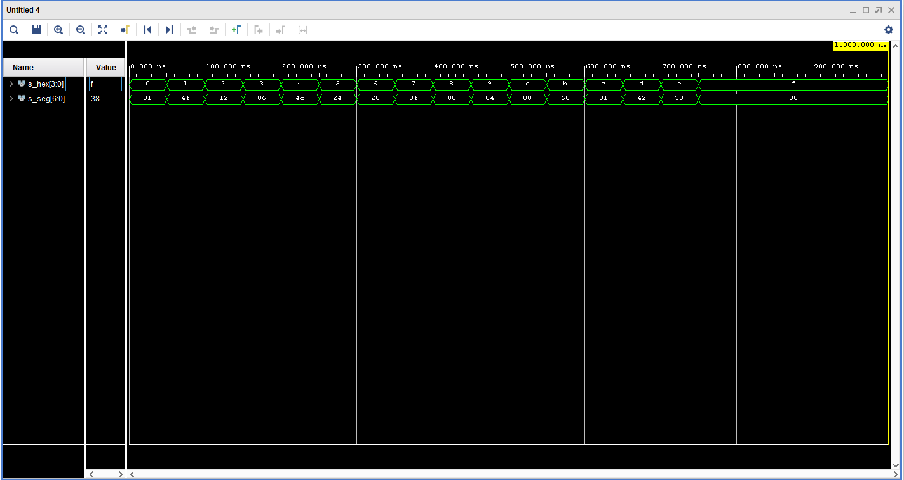

# Lab 4: Matúš Šándor

### Seven-segment display decoder

1. Listing of VHDL stimulus process from testbench file (`tb_hex_7seg.vhd`) with asserts. Verify all input combinations. Always use syntax highlighting, meaningful comments, and follow VHDL guidelines:

```vhdl
    p_stimulus : process
    begin
        report "Stimulus process started" severity note;

        -- First test case
        hex_i <= "0000"; wait for 50 ns;
        assert (seg_o = "0000001")
        report "Input combination 0000 FAILED" severity error;
        hex_i <= "0001"; wait for 50 ns;
        assert (seg_o = "1001111")
        report "Input combination 0000 FAILED" severity error;
        hex_i <= "0010"; wait for 50 ns;
        assert (seg_o = "0010010")
        report "Input combination 0000 FAILED" severity error;
        hex_i <= "0011"; wait for 50 ns;
        assert (seg_o = "0000110")
        report "Input combination 0000 FAILED" severity error;
        hex_i <= "0100"; wait for 50 ns;
        assert (seg_o = "1001100")
        report "Input combination 0000 FAILED" severity error;
        hex_i <= "0101"; wait for 50 ns;
        assert (seg_o = "0100100")
        report "Input combination 0000 FAILED" severity error;
        hex_i <= "0110"; wait for 50 ns;
        assert (seg_o = "0100000")
        report "Input combination 0000 FAILED" severity error;
        hex_i <= "0111"; wait for 50 ns;
        assert (seg_o = "0001111")
        report "Input combination 0000 FAILED" severity error;
        hex_i <= "1000"; wait for 50 ns;
        assert (seg_o = "0000000")
        report "Input combination 0000 FAILED" severity error;
        hex_i <= "1001"; wait for 50 ns;
        assert (seg_o = "0000100")
        report "Input combination 0000 FAILED" severity error;
        hex_i <= "1010"; wait for 50 ns;
        assert (seg_o = "0001000")
        report "Input combination 0000 FAILED" severity error;
        hex_i <= "1011"; wait for 50 ns;
        assert (seg_o = "1100000")
        report "Input combination 0000 FAILED" severity error;
        hex_i <= "1100"; wait for 50 ns;
        assert (seg_o = "0110001")
        report "Input combination 0000 FAILED" severity error;
        hex_i <= "1101"; wait for 50 ns;
        assert (seg_o = "1000010")
        report "Input combination 0000 FAILED" severity error;
        hex_i <= "1110"; wait for 50 ns;
        assert (seg_o = "0110000")
        report "Input combination 0000 FAILED" severity error;
        hex_i <= "1111"; wait for 50 ns;
        assert (seg_o = "0111000")
        report "Input combination 0000 FAILED" severity error;

        report "Stimulus process finished" severity note;
        wait;
    end process p_stimulus;
```

2. Screenshot with simulated time waveforms. Always display all inputs and outputs (display the inputs at the top of the image, the outputs below them) at the appropriate time scale!

   

### LED(7:4) indicators

1. Listing of LEDs(7:4) part of VHDL architecture from source file `top.vhd`. Try to write logic functions as simple as possible. Always use syntax highlighting, meaningful comments, and follow VHDL guidelines:

   ```vhdl
   --------------------------------------------------------------------
   -- Experiments on your own: LED(7:4) indicators

    -- Turn LED(4) on if input value is equal to 0, ie "0000"
    LED(4) <= NOT( SW(0) OR SW(1) OR SW(2) OR SW(3));

    -- Turn LED(5) on if input value is greater than "1001", ie 10, 11, 12, ...
    greater_less : process ( SW ) is
  begin
  if SW > "1010" then
    LED(5) <= '1' ;
  else
    LED(5) <= '0' ;
  end if ;
end process greater_less;

    -- Turn LED(6) on if input value is odd, ie 1, 3, 5, ...
    LED(6) <= SW(0);

    -- Turn LED(7) on if input value is a power of two, ie 1, 2, 4, or 8
        power_of_two : process ( SW ) is
         begin
          if SW = "1000" OR SW = "0100" OR SW = "0010" OR SW = "0001" then
          LED(7) <= '1' ;
         else 
           LED(7) <= '0';
         end if ;
        end process power_of_two;
   ```
