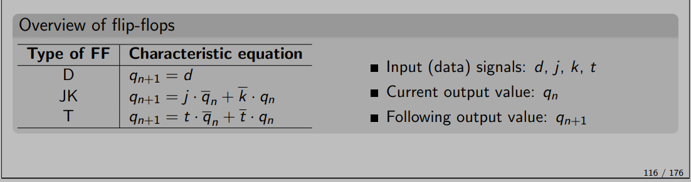

## Preparation tasks (done before the lab at home)

1. Write characteristic equations and complete truth tables for D, JK, T flip-flops where `q(n)` represents main output value before the clock edge and `q(n+1)` represents value after the clock edge.

<!--
\begin{align*}
    q_{n+1}^D =&~ \\
    q_{n+1}^{JK} =&\\
    q_{n+1}^T =&\\
\end{align*}
-->

   | **clk** | **d** | **q(n)** | **q(n+1)** | **Comments** |
   | :-: | :-: | :-: | :-: | :-- |
   |  | 0 | 0 |  |  |
   |  | 0 | 1 |  |  |
   |  | 1 |  |  |  |
   |  | 1 |  |  |  |

   | **clk** | **j** | **k** | **q(n)** | **q(n+1)** | **Comments** |
   | :-: | :-: | :-: | :-: | :-: | :-- |
   |  | 0 | 0 | 0 | 0 | No change |
   |  | 0 | 0 | 1 | 1 | No change |
   |  | 0 |  |  |  |  |
   |  | 0 |  |  |  |  |
   |  | 1 |  |  |  |  |
   |  | 1 |  |  |  |  |
   |  | 1 |  |  |  |  |
   |  | 1 |  |  |  |  |

   | **clk** | **t** | **q(n)** | **q(n+1)** | **Comments** |
   | :-: | :-: | :-: | :-: | :-- |
   |  | 0 | 0 |  |  |
   |  | 0 | 1 |  |  |
   |  | 1 |  |  |  |
   |  | 1 |  |  |  |
